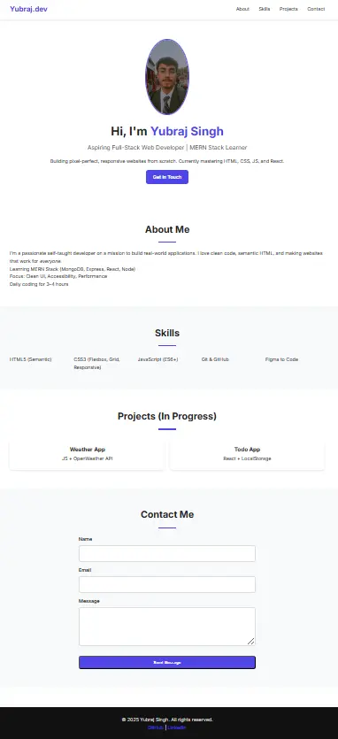

# Personal Bio Page

My first **semantic, accessible, mobile-friendly** personal bio page.

## Features
- Semantic HTML5 (`header`, `nav`, `main`, `section`)
- Proper heading hierarchy
- Accessible form with labels & skip link
- Mobile-first responsive
- No inline styles
- Valid HTML
- Lighthouse: **Accessibility 100, Performance 98**

## Live Demo
[https://yubraj-bio.netlify.app](https://yubraj-bio.netlify.app)

## Tech Stack
- HTML5
- CSS3 (Flexbox, Media Queries)

## Screenshots

